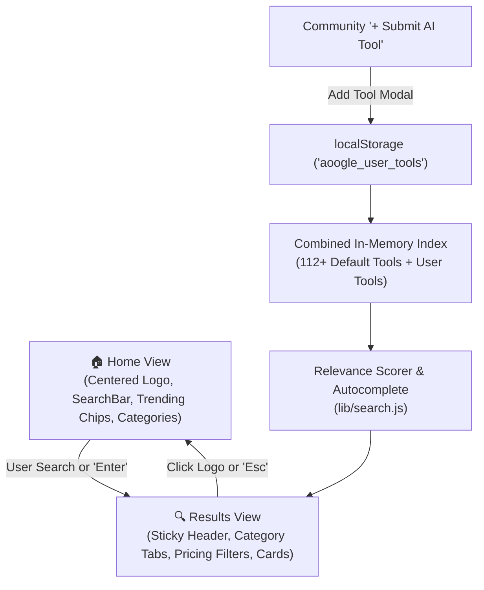

<div align="center">

# 🌐 Aoogle

### **The Google for AI Tools.**
*Search by task, not by hype. Find the exact AI tool for any job in milliseconds.*

[](https://react.dev/)
[](https://vitejs.dev/)
[](LICENSE)
[](https://github.com/vistaratech/aoogle/pulls)
[](#privacy--zero-tracking)

<br/>

[**Explore Features**](#-key-features) •
[**Quick Start**](#-quick-start) •
[**How Search Works**](#-how-the-ranking-engine-works) •
[**Submit Your AI Tool**](#-submit--register-your-ai-tool) •
[**Roadmap**](#-roadmap)

</div>

---

## 💡 Why Aoogle?

When you search for an AI tool on traditional search engines, you get:
- ❌ 10 SEO-stuffed affiliate blog articles ("Top 25 AI Tools in 2026...")
- ❌ Paid sponsored ads overshadowing real tools
- ❌ Cluttered interfaces requiring signups

**Aoogle changes this:**
- ✅ **Task-Oriented Search**: Type what you want to achieve (*"remove background from photo"*, *"clone a voice"*, *"turn text into video"*), and Aoogle directly ranks the tools that actually do it.
- ✅ **Zero Trackers, Zero Ads**: Pure utility. Instant results right in the browser.
- ✅ **Google-Inspired Simplicity**: Centered landing page with instant transition to a Google-style search result experience.

---

## ✨ Key Features

| Feature | Description |
| :--- | :--- |
| 🎯 **Task-First Ranking** | Evaluates multi-word phrases and tags to deliver high-confidence AI tools instantly. |
| 🌗 **Dark & Light Mode** | Sleek dark glassmorphism theme and crisp Google-style light mode with persistent memory. |
| ⚡ **Sub-Millisecond Autocomplete** | Live keyboard-navigable suggestion dropdown as you type with task tags and tool names. |
| 🏷️ **Google-Style Category Tabs** | Filter through 13+ categories (Image, Video, Audio, Code, Writing, 3D, Design, Meetings, etc.). |
| 💰 **Pricing Filters** | Instant chip filters for **Free**, **Freemium**, and **Paid** AI tools. |
| 🚀 **Creator Tool Registration** | Built-in modal allowing developers and creators to submit their AI tools with live browser indexing. |
| ⌨️ **Power Keyboard Shortcuts** | Press `/` anywhere to focus search, `↑`/`↓` to browse suggestions, `Enter` to open, `Escape` to go home. |
| 🎲 **"I'm Feeling Lucky"** | Instantly navigates to the top-ranked AI tool for your query. |
| 🔒 **100% Client-Side & Private** | No user tracking, no third-party cookies, no database lock-in. |

---

## 🚀 Quick Start

Run Aoogle locally in less than 60 seconds:

### Prerequisites
- Node.js (v18 or higher recommended)
- npm or pnpm or yarn

### Installation

```bash
# 1. Clone the repository
git clone https://github.com/vistaratech/aoogle.git

# 2. Enter the project directory
cd aoogle

# 3. Install dependencies
npm install

# 4. Start development server
npm run dev
```

Open your browser at **`http://localhost:5173`** to test Aoogle!

### Production Build

```bash
# Build optimized production bundle
npm run build

# Preview production build locally
npm run preview
```

---

## 🛠️ Tech Stack & Architecture

Aoogle is engineered to be lightweight, lightning-fast, and completely independent of proprietary cloud lock-ins:

```
├── Framework:        React 19 (Hooks, Suspense, State Routing)
├── Build Tool:       Vite 8 (Instant HMR & Lightning Fast Rollup Bundles)
├── Styling:          Pure Vanilla CSS (Tokens, CSS Variables, Glassmorphism, Micro-animations)
├── Search Engine:    Handcrafted In-Memory Phrase Scorer (Zero external bloat)
└── Data & State:     Curated 112+ tools dataset + LocalStorage persistence
```

### Architecture Diagram



---

## 🧠 How the Ranking Engine Works

Unlike generic fuzzy-search libraries that produce noisy false positives, `src/lib/search.js` uses a weighted task-relevance algorithm:

1. **Normalized Multi-Word Match (+10 pts)**:
   Exact matches against intentional human phrases (*"remove background"*, *"text to speech"*, *"code review"*) receive dominant priority.
2. **Word-Level Tag Match (+3 pts)**:
   Matching individual task keywords inside the tool's verified use cases.
3. **Name Match (+2 pts)**:
   Query matching the tool's brand name.
4. **Description & Category (+1 pt)**:
   Contextual matches across the summary.
5. **Threshold Filter**:
   Results below 35% of the highest matching score are automatically dropped to eliminate spam and irrelevant results.

---

## ➕ Submit & Register Your AI Tool

Are you an AI developer or creator? You can submit your AI tool directly inside Aoogle:

1. Click **"+ Submit AI Tool"** on the top navigation bar.
2. Enter your:
   - **Tool Name** & **Website URL**
   - **Category** (Image, Code, Audio, etc.) & **Pricing Tier**
   - **Description** & **Use-Case Keywords** (comma-separated tags)
   - **Creator Name / Handle**
3. Click **"Register AI Tool"**!
4. Your tool is immediately indexed, searchable across all task queries, and highlighted with a **`✨ Community`** badge.

---

## ⌨️ Keyboard Shortcuts

| Key | Action |
| :---: | :--- |
| <kbd>/</kbd> | Instantly focus the search bar from anywhere on the page |
| <kbd>↓</kbd> / <kbd>↑</kbd> | Navigate autocomplete suggestions |
| <kbd>Enter</kbd> | Search / select active suggestion |
| <kbd>Escape</kbd> | Clear suggestions / return to the Home page |

---

## 🗺️ Roadmap

- [x] Two-view Google-style architecture (Home + Results)
- [x] Dark Mode and Light Mode with smooth transition
- [x] Sub-millisecond autocomplete and keyboard navigation
- [x] Creator AI Tool submission & local persistence
- [ ] **Open-Source LLM Integration**: Dynamic web discovery using free open-source models (Llama 3.3, Mistral) for queries outside the static index.
- [ ] **Cloud Database Sync**: Optional Supabase integration for community-wide global upvotes and submissions.
- [ ] **Vector Semantic Search**: Cosine similarity using client-side WebAssembly embeddings.

---

## 🤝 Contributing

Contributions are welcome! If you'd like to add a new AI tool or improve the engine:

1. **Fork the repo**
2. **Create your feature branch**:
   ```bash
   git checkout -b feature/awesome-ai-tool
   ```
3. **Add new tools** to [`src/data/tools.js`](src/data/tools.js):
   ```javascript
   {
     id: 'your-tool',
     name: 'Your Tool Name',
     url: 'https://yourtool.com',
     category: 'Code',
     pricing: 'Freemium', // 'Free' | 'Freemium' | 'Paid'
     description: 'Concise summary of what it achieves.',
     tags: ['task one', 'task two', 'use case']
   }
   ```
4. **Commit your changes**:
   ```bash
   git commit -m "feat: add Your Tool Name to tools index"
   ```
5. **Push to the branch**:
   ```bash
   git push origin feature/awesome-ai-tool
   ```
6. **Open a Pull Request**

---

## 📄 License

This project is licensed under the **MIT License** — feel free to use, fork, and build upon it!

<div align="center">

⭐ **If you find Aoogle useful, please give this repository a star!** ⭐

Crafted with ❤️ by [Yohesh](https://github.com/vistaratech)

</div>
