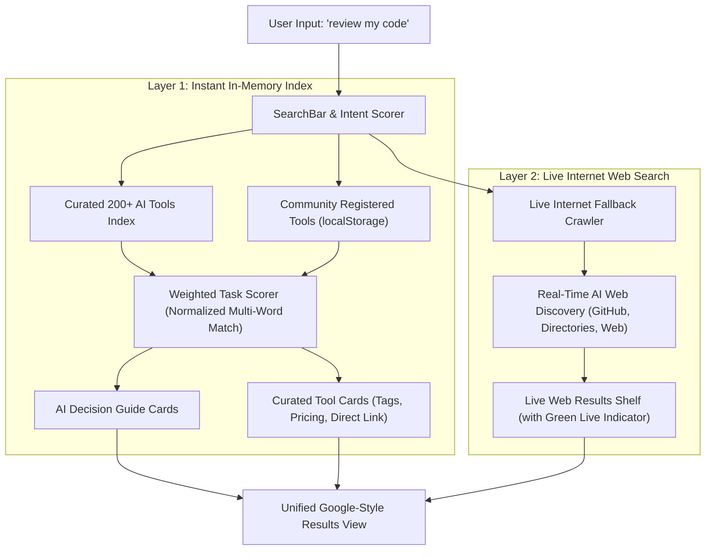

<div align="center">

# 🌐 Aoogle

### **The Google Alternative Search Engine for AI Tools**
*Stop browsing 20 SEO-stuffed affiliate blogs. Find the exact AI tool for any task in milliseconds.*

[](https://react.dev/)
[](https://vitejs.dev/)
[](LICENSE)
[](#-dual-engine-search-architecture)
[](#-privacy--zero-tracking)

<br/>

[**Live Demo**](http://localhost:5173) •
[**Why Aoogle?**](#-the-problem-with-searching-ai-tools-on-google) •
[**Core Features**](#-core-features) •
[**AI Decision Engine**](#-ai-decision-engine) •
[**Quick Start**](#-quick-start) •
[**Architecture**](#-architecture--how-it-works) •
[**Contributing**](#-contributing)

</div>

---

## 🧐 The Problem with Searching AI Tools on Google

When you open Google and search:
> *"Best AI tool to remove background from video"* or *"AI tool to review pull requests"*

You typically get:
- ❌ **Top 4-5 sponsored ad slots** bidding for ad revenue rather than quality.
- ❌ **SEO affiliate listicle blogs** (*"Top 35 AI Tools in 2026 - You Won't Believe #7!"*) written for ad clicks, not developer productivity.
- ❌ **Outdated directories** listing discontinued or broken tools.
- ❌ **No direct answers** on whether a tool is free, freemium, or paid without signing up first.

---

## 💡 The Aoogle Solution

**Aoogle** is an open-source, Google-alternative search engine engineered specifically for the AI era. Instead of ranking blog articles, Aoogle acts as an **intelligent task-to-tool search engine**:

1. **Search by Task, Not by Brand**: Type *"clone a voice"*, *"write a resume"*, *"review my code"*, or *"turn text into 3D model"*.
2. **Built-in AI Decision Guide**: Gives you the **Top Recommendation**, the **Best Free Option**, and a **Quick Alternative** right at the top.
3. **Dual-Engine Search**: Combines a curated, verified index of 200+ top AI tools with a **real-time internet web search crawler** for discovering fresh tools across the entire web.
4. **Zero Ads, Zero Tracking**: 100% client-side privacy, instantaneous sub-millisecond response times, and pure utility.

---

## ✨ Core Features

| Feature | Details |
| :--- | :--- |
| 🎯 **Task-Oriented Query Parsing** | Matches natural language task intents (*"remove background"*, *"transcribe audio"*, *"unit tests"*). |
| 🧠 **AI Decision Guide** | Instant AI overview panel breaking down the #1 Best Pick, #1 Free Pick, and Alternative with pros and verdicts. |
| 🌐 **Live Internet Search** | Fallback web crawler scanning public AI directories, GitHub repos, and internet databases in real-time. |
| 🎙️ **Voice Search (Speech-to-Text)** | Hands-free search built directly with the Web Speech API with live mic waveform feedback. |
| 💰 **Instant Pricing Filters** | Filter between **All**, **Free**, **Freemium**, and **Paid** with one click. |
| 🏷️ **13+ Category Explorers** | Instant filtering for Image, Video, Audio, Code, Writing, 3D, Design, Meetings, Marketing, etc. |
| 🌗 **Pixel-Perfect Google Aesthetics** | Authentic Google-inspired minimalist design with dark glassmorphism and crisp light modes. |
| ➕ **Community Tool Submissions** | Allows developers and creators to register their AI tools directly with local persistence. |
| 📱 **Adaptive Single-Page Mobile UI** | Strictly tuned zero-scroll home screen for both desktop and mobile viewports. |
| ⌨️ **Keyboard Navigation** | Global hotkeys (<kbd>/</kbd> to search, <kbd>↑</kbd>/<kbd>↓</kbd> suggestions, <kbd>Esc</kbd> go home). |

---

## 🧠 AI Decision Engine

When you search for any task, Aoogle's Decision Guide analyzes the indexed database and presents a structured comparison card:

```
┌────────────────────────────────────────────────────────────────────────┐
│  ✨ AI DECISION ENGINE                                                 │
│  Which AI tool is best for "review my code"?                           │
│                                                                        │
│  ┌───────────────────────┐ ┌───────────────────────┐ ┌───────────────┐ │
│  │ 🏆 TOP RECOMMENDATION │ │ ⚡ BEST FREE OPTION   │ │ 💡 QUICK ALT  │ │
│  │ CodeRabbit [Freemium] │ │ AutoGPT        [Free] │ │ Canva Studio  │ │
│  │ AI pull request review│ │ Autonomous open-source│ │ Quick inline  │ │
│  │ with line-by-line tips│ │ code review agent     │ │ code design   │ │
│  └───────────────────────┘ └───────────────────────┘ └───────────────┘ │
└────────────────────────────────────────────────────────────────────────┘
```

- **Top Recommendation**: Selected based on highest task-relevance score and community adoption.
- **Best Free Option**: Identifies the top tool that offers a genuinely free tier or open-source license.
- **Quick Alternative**: A fast, browser-friendly or all-in-one alternative solution.

---

## 🌐 Dual-Engine Search Architecture

Aoogle operates on a dual-layer search pipeline:



1. **Layer 1 (Instant Local Index)**:
   - Scored in under **5ms** using a weighted algorithm:
     - Exact Multi-Word Task Match: `+10 pts`
     - Keyword Tag Match: `+3 pts`
     - Brand Name Match: `+2 pts`
     - Summary Context: `+1 pt`
2. **Layer 2 (Live Internet Crawler)**:
   - Parallel asynchronous query searching across live internet repositories and open AI catalogs.
   - Discovered tools are dynamically displayed with a **`🟢 Live from the Web`** badge and source origin.

---

## 🚀 Quick Start

Run Aoogle locally in under a minute:

### Prerequisites
- [Node.js](https://nodejs.org/) (version 18 or higher recommended)
- `npm`, `pnpm`, or `yarn`

### 1. Clone & Install

```bash
# Clone the repository
git clone https://github.com/vistaratech/aoogle.git

# Enter project directory
cd aoogle

# Install dependencies
npm install
```

### 2. Run the Development Server

```bash
npm run dev
```

Open your browser and navigate to **`http://localhost:5173`**.

### 3. Build for Production

```bash
# Creates an optimized bundle in /dist
npm run build

# Preview the production build locally
npm run preview
```

---

## 🛠️ Tech Stack

- **Frontend Core**: [React 19](https://react.dev/) (Hooks, Memoization, State-Driven Routing)
- **Bundler & Dev Server**: [Vite 8](https://vitejs.dev/)
- **Styling**: Pure Modern CSS (CSS Custom Properties, Glassmorphism, Micro-Animations, Zero Tailwind bloat)
- **Voice Recognition**: Web Speech API (`SpeechRecognition` / `webkitSpeechRecognition`)
- **State & Storage**: Browser `localStorage` for community submissions and theme preference
- **Icons**: Custom optimized SVG icon set

---

## 📂 Project Structure

```
aoogle/
├── public/
│   ├── favicon.svg
│   └── poster.html
├── src/
│   ├── components/
│   │   ├── AiDecisionGuide.jsx    # "Which AI tool is best?" recommendation guide
│   │   ├── CategoryIcons.jsx      # Home page category shortcut grid
│   │   ├── ResultCard.jsx         # AI tool result card with pricing & tags
│   │   ├── SearchBar.jsx          # Search bar with autocomplete & voice search
│   │   ├── SearchHeader.jsx       # Sticky Google-style search results header
│   │   ├── SubmitToolModal.jsx    # Modal to submit custom AI tools
│   │   ├── ThemeToggle.jsx        # Smooth Dark/Light mode switch
│   │   ├── TrendingChips.jsx      # Clickable trending task query pills
│   │   ├── WebSearchResults.jsx   # Live web crawler results shelf
│   │   └── icons.jsx              # Lightweight SVG icon collection
│   ├── data/
│   │   └── tools.js               # 200+ curated and verified AI tools database
│   ├── lib/
│   │   ├── liveWebSearch.js       # Multi-engine internet search crawler
│   │   └── search.js              # In-memory weighted task ranking engine
│   ├── App.jsx                    # Root application component & view manager
│   ├── index.css                  # Design system & responsive layout tokens
│   └── main.jsx                   # Entry point
├── index.html                     # HTML5 template with SEO metadata
├── package.json                   # Dependencies & scripts
└── vite.config.js                 # Vite build configuration
```

---

## ⌨️ Keyboard Shortcuts

| Key | Action |
| :---: | :--- |
| <kbd>/</kbd> | Instantly focus the search bar from anywhere |
| <kbd>↓</kbd> / <kbd>↑</kbd> | Navigate live autocomplete suggestions |
| <kbd>Enter</kbd> | Execute search / select active suggestion |
| <kbd>Escape</kbd> | Dismiss autocomplete / return to Home page |

---

## ➕ Registering Your AI Tool

Creators and developers can submit their tools directly inside the app:

1. Click **"+ Submit AI Tool"** on the home page.
2. Provide:
   - **Tool Name** & **Website URL**
   - **Category** (Image, Code, Audio, Writing, Design, etc.)
   - **Pricing Tier** (Free, Freemium, Paid)
   - **Task Tags** (e.g., *"code review, pull requests, automated tests"*)
3. The tool is instantly indexed in your browser and will appear in future task searches marked with a **`✨ Community`** badge.

---

## 🔒 Privacy & Zero Tracking

- **No Third-Party Trackers**: No Google Analytics, no Facebook pixels, no tracking cookies.
- **No Account Required**: Search immediately without creating an account or providing an email.
- **Zero Sponsored Content**: Results are ranked strictly by task relevance, not advertising spend.

---

## 🗺️ Roadmap

- [x] Strict Single-Page zero-scroll Home view (Desktop + Mobile)
- [x] AI Decision Guide (Top Pick, Best Free, Quick Alternative)
- [x] Real-time Internet Web Search fallback
- [x] Speech-to-Text Voice Search integration
- [x] Pricing Filters & Category Tab Explorers
- [ ] **AI Model Comparison Matrix**: Side-by-side benchmark comparison for LLMs and image models.
- [ ] **Decentralized Upvoting**: Community voting system backed by decentralized storage.
- [ ] **Browser Extension**: Search Aoogle directly from your browser's address bar.

---

## 🤝 Contributing

Contributions make the open-source community thrive! To add new AI tools or features:

1. **Fork the Project**
2. **Create your Feature Branch**:
   ```bash
   git checkout -b feature/add-new-ai-tool
   ```
3. **Add tool data** in `src/data/tools.js`:
   ```javascript
   {
     id: 'tool-name',
     name: 'Tool Name',
     url: 'https://example.com',
     category: 'Code',
     pricing: 'Freemium', // 'Free' | 'Freemium' | 'Paid'
     description: 'A clear one-sentence summary of the task it performs.',
     tags: ['task one', 'task two', 'keyword']
   }
   ```
4. **Commit your changes**:
   ```bash
   git commit -m "feat: add Tool Name to AI tool directory"
   ```
5. **Push to the branch**:
   ```bash
   git push origin feature/add-new-ai-tool
   ```
6. **Open a Pull Request**

---

## 📄 License

Distributed under the **MIT License**. See [`LICENSE`](LICENSE) for more information.

<div align="center">

⭐ **Love this project? Star this repository to support independent open-source search!** ⭐

Built with ❤️ by [Yohesh](https://github.com/vistaratech)

</div>
